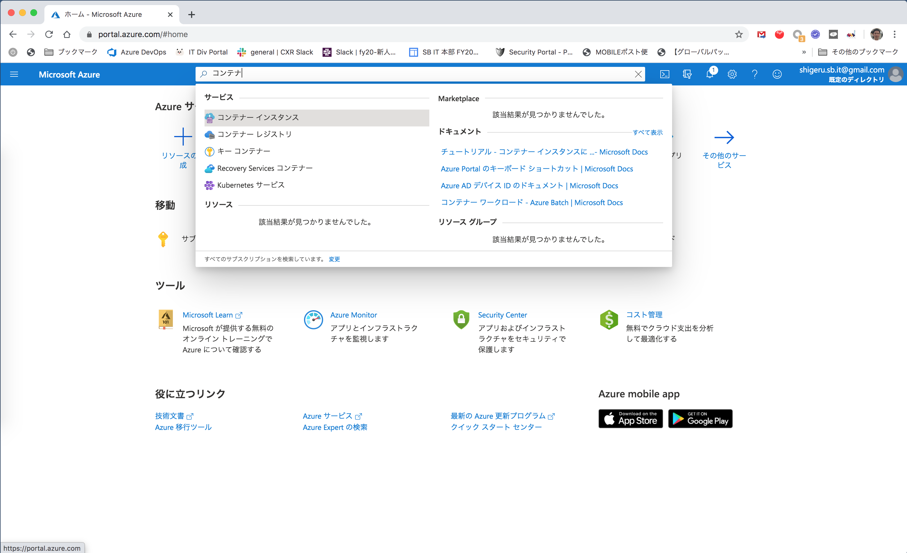
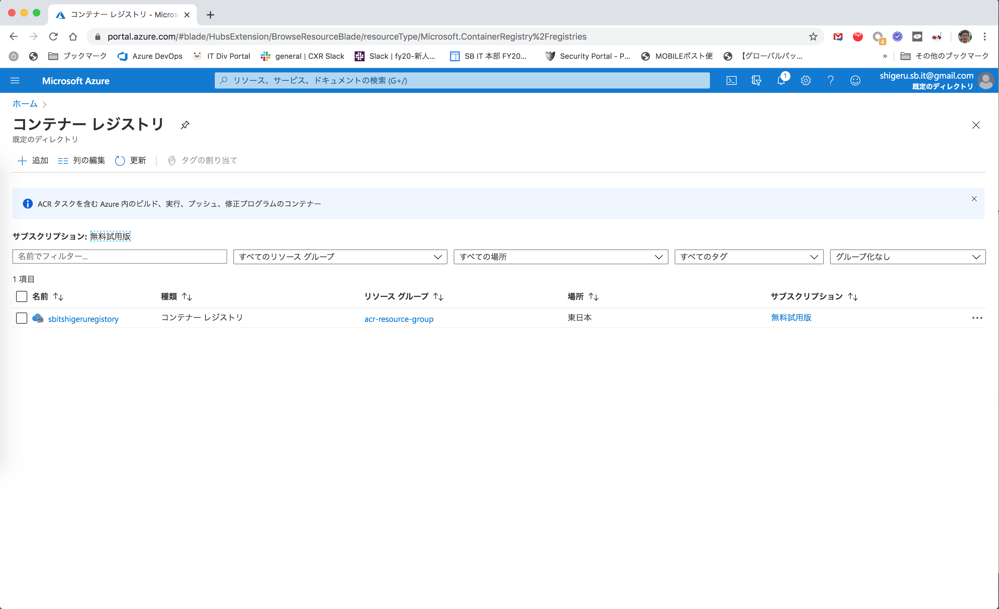
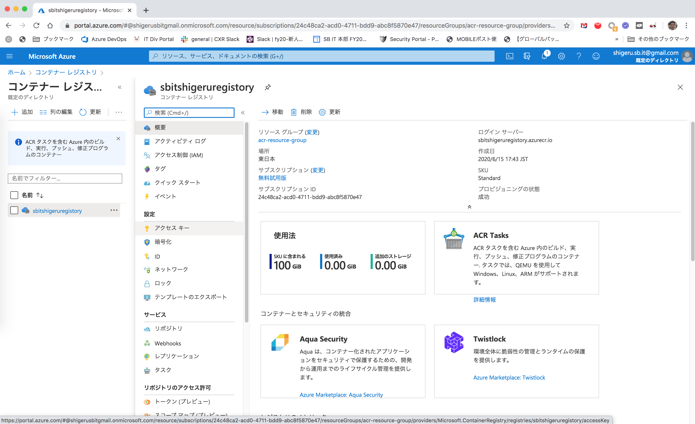
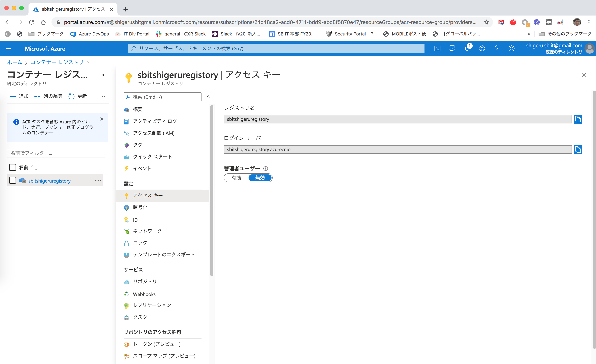
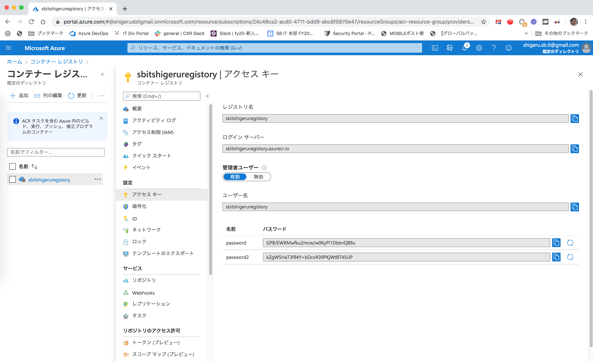

# Azure Kubernetes Service 研修環境の構築

このドキュメントでは新人研修用の Azure Kubernetes Service 研修環境の構築手順について説明します。

## リソースプロバイダの確認

以下のコマンドを実行し、AKS に必要なリソース・プロバイダーを有効にします。

```
$ az provider register --namespace Microsoft.Network
$ az provider register --namespace Microsoft.Storage
$ az provider register --namespace Microsoft.Compute
$ az provider register --namespace Microsoft.ContainerService
```

以下のコマンドを実行して、リソースプロバイダが Registered となっていることを確認します。

```
$ az provider list -o table
Namespace                               RegistrationPolicy    RegistrationState
--------------------------------------  --------------------  -------------------
Microsoft.Network                       RegistrationRequired  Registered
Microsoft.Storage                       RegistrationRequired  Registered
Microsoft.Compute                       RegistrationRequired  Registered
Microsoft.ContainerService              RegistrationRequired  Registered
84codes.CloudAMQP                       RegistrationRequired  NotRegistered
Conexlink.MyCloudIT                     RegistrationRequired  NotRegistered
　　　　　　　　　　　　　　　　　　　　　　:
```

## Azure Containers Registory (ACR) の作成

### ACR 名の確認

ACR のレジストリ名は Azure 内でユニークである必要があります。まずは、以下のコマンドで ACR 名が利用可能であるか確認してください
ACR 名は英数字としてください。nameAvailable が true であれば利用可能です。

```
$ az acr check-name -n sbitshigeruregistory
{
  "message": null,
  "nameAvailable": true,
  "reason": null
}
```

### ACR のリソースグループ作成

ACR を作る前にリソースグループを作成する必要があります。リソースグループは、Azure 内でユニークである必要はなく、
皆さんのテナント内でユニークであれば問題ありません。以下のコマンドで、ACR 用のリソースグループを作成します。

```
$ az group create \
           --resource-group acr-resource-group \
           --location japaneast
{
  "id": "/subscriptions/24c48ca2-acd0-4711-bdd9-abc8f5870e47/resourceGroups/acr-resource-group",
  "location": "japaneast",
  "managedBy": null,
  "name": "acr-resource-group",
  "properties": {
    "provisioningState": "Succeeded"
  },
  "tags": null,
  "type": "Microsoft.Resources/resourceGroups"
}
```

### ACR の作成

作成したリソースグループに ACR を作成します。ACR の名前には、先程、利用可能であることを確認した名前を指定してください。

```
$ az acr create \
         --name sbitshigeruregistory \
         --resource-group acr-resource-group \
         --sku Standard \
         --location japaneast
{- Finished ..
  "adminUserEnabled": false,
  "creationDate": "2020-06-15T08:43:32.818045+00:00",
  "dataEndpointEnabled": false,
  "dataEndpointHostNames": [],
  "encryption": {
    "keyVaultProperties": null,
    "status": "disabled"
  },
  "id": "/subscriptions/24c48ca2-acd0-4711-bdd9-abc8f5870e47/resourceGroups/acr-resource-group/providers/Microsoft.ContainerRegistry/registries/sbitshigeruregistory",
  "identity": null,
  "location": "japaneast",
  "loginServer": "sbitshigeruregistory.azurecr.io",
  "name": "sbitshigeruregistory",
  "networkRuleSet": null,
  "policies": {
    "quarantinePolicy": {
      "status": "disabled"
    },
    "retentionPolicy": {
      "days": 7,
      "lastUpdatedTime": "2020-06-15T08:43:35.007218+00:00",
      "status": "disabled"
    },
    "trustPolicy": {
      "status": "disabled",
      "type": "Notary"
    }
  },
  "privateEndpointConnections": [],
  "provisioningState": "Succeeded",
  "publicNetworkAccess": "Enabled",
  "resourceGroup": "acr-resource-group",
  "sku": {
    "name": "Standard",
    "tier": "Standard"
  },
  "status": null,
  "storageAccount": null,
  "tags": {},
  "type": "Microsoft.ContainerRegistry/registries"
}
```

## Azure Kubernetes Service (AKS) 作成

### AKS のリソースグループ作成

AKS を作る場合も、リソースグループを作成する必要があります。以下のコマンドで、AKS 用のリソースグループを作成します。

```
$ az group create \
           --name aks-resource-group \
           --location japaneast
{
  "id": "/subscriptions/24c48ca2-acd0-4711-bdd9-abc8f5870e47/resourceGroups/aks-resource-group",
  "location": "japaneast",
  "managedBy": null,
  "name": "aks-resource-group",
  "properties": {
    "provisioningState": "Succeeded"
  },
  "tags": null,
  "type": "Microsoft.Resources/resourceGroups"
}
```

### AKS の Virtual Network の作成

AKS が使用する Virtual Network を作成します。以下のコマンドで、先程作成した AKS 用のリソースグループを指定して作成します。

```
$ az network vnet create \
             --name aks-vnet \
             --resource-group aks-resource-group \
             --location japaneast \
             --address-prefixes 10.1.0.0/16
{
  "newVNet": {
    "addressSpace": {
      "addressPrefixes": [
        "10.1.0.0/16"
      ]
    },
    "bgpCommunities": null,
    "ddosProtectionPlan": null,
    "dhcpOptions": {
      "dnsServers": []
    },
    "enableDdosProtection": false,
    "enableVmProtection": false,
    "etag": "W/\"8287498e-3fb4-43f2-906b-312e721d9780\"",
    "id": "/subscriptions/24c48ca2-acd0-4711-bdd9-abc8f5870e47/resourceGroups/aks-resource-group/providers/Microsoft.Network/virtualNetworks/aks-vnet",
    "ipAllocations": null,
    "location": "japaneast",
    "name": "aks-vnet",
    "provisioningState": "Succeeded",
    "resourceGroup": "aks-resource-group",
    "resourceGuid": "8d83f82a-2079-48c4-a073-f1ba81eff62e",
    "subnets": [],
    "tags": {},
    "type": "Microsoft.Network/virtualNetworks",
    "virtualNetworkPeerings": []
  }
}
```

### サービスプリンシパルの作成

以下のコマンドでサービスプリンシパルを作成します。

```
$ az ad sp create-for-rbac --skip-assignment
{
  "appId": "2d79a51c-3e7d-4902-a0f6-57fb91cdfda2",
  "displayName": "azure-cli-2020-06-15-11-55-18",
  "name": "http://azure-cli-2020-06-15-11-55-18",
  "password": "oCiB1lXEBHOa7dByQM01B1L.t39ap8BNm_",
  "tenant": "0ee138b5-7f4e-41d1-8c20-7ffcb1d1c497"
}
```

ここで、実行結果の appId は、後述のロールのアサイン時の --assignee、および AKS クラスタの作成時の --service-principal に指定し、
password は AKS クラスタ作成時の --client-secret に指定するので、実行結果は記録しておいてください。

### VNet ID の確認

以下のコマンドを実行し、aks-vnet の VNet ID を確認します。

```
$ az network vnet show \
             --resource-group aks-resource-group \
             --name aks-vnet \
             --query id -o tsv
/subscriptions/24c48ca2-acd0-4711-bdd9-abc8f5870e47/resourceGroups/aks-resource-group/providers/Microsoft.Network/virtualNetworks/aks-vnet
```

### ロールのアサイン

以下のコマンドでロールのアサインを実行します。
--assignee に、サービスプリンシパル作成時の appId、--scope に、aks-vnet の VNet ID を指定することに注意してください。

```
$ az role assignment create \
          --assignee 2d79a51c-3e7d-4902-a0f6-57fb91cdfda2 \
          --scope /subscriptions/24c48ca2-acd0-4711-bdd9-abc8f5870e47/resourceGroups/aks-resource-group/providers/Microsoft.Network/virtualNetworks/aks-vnet \
          --role Contributor
{
  "canDelegate": null,
  "id": "/subscriptions/24c48ca2-acd0-4711-bdd9-abc8f5870e47/resourceGroups/aks-resource-group/providers/Microsoft.Network/virtualNetworks/aks-vnet/providers/Microsoft.Authorization/roleAssignments/f9e85969-007b-400f-8156-13b7a54cabd1",
  "name": "f9e85969-007b-400f-8156-13b7a54cabd1",
  "principalId": "6a4d66e2-a977-4758-a00d-1c8a149b5de2",
  "principalType": "ServicePrincipal",
  "resourceGroup": "aks-resource-group",
  "roleDefinitionId": "/subscriptions/24c48ca2-acd0-4711-bdd9-abc8f5870e47/providers/Microsoft.Authorization/roleDefinitions/b24988ac-6180-42a0-ab88-20f7382dd24c",
  "scope": "/subscriptions/24c48ca2-acd0-4711-bdd9-abc8f5870e47/resourceGroups/aks-resource-group/providers/Microsoft.Network/virtualNetworks/aks-vnet",
  "type": "Microsoft.Authorization/roleAssignments"
}
```

### サポートされている Kubernetes のバージョンの確認

以下のコマンドを実行し、このリージョンでサポートされている Kubernetes のバージョンを確認します。
以下のケースでは 1.16.9 が、最新の stable バージョンです。

```
$ az aks get-versions \
         --location japaneast \
         --output table
KubernetesVersion    Upgrades
-------------------  -------------------------------------------------
1.18.2(preview)      None available
1.18.1(preview)      1.18.2(preview)
1.17.5(preview)      1.18.1(preview), 1.18.2(preview)
1.17.4(preview)      1.17.5(preview), 1.18.1(preview), 1.18.2(preview)
1.16.9               1.17.4(preview), 1.17.5(preview)
1.16.8               1.16.9, 1.17.4(preview), 1.17.5(preview)
1.15.11              1.16.8, 1.16.9
1.15.10              1.15.11, 1.16.8, 1.16.9
1.14.8               1.15.10, 1.15.11
1.14.7               1.14.8, 1.15.10, 1.15.11
```

### AKS 用の Subnet の作成

以下のコマンドを実行して、AKS 用の Subnet を作成します。

```
$ az network vnet subnet create \
             --name aks-subnet \
             --resource-group aks-resource-group \
             --vnet-name aks-vnet \
             --address-prefix 10.1.0.0/24
{
  "addressPrefix": "10.1.0.0/24",
  "addressPrefixes": null,
  "delegations": [],
  "etag": "W/\"75398623-cbeb-4e41-a188-9bffd2b55349\"",
  "id": "/subscriptions/24c48ca2-acd0-4711-bdd9-abc8f5870e47/resourceGroups/aks-resource-group/providers/Microsoft.Network/virtualNetworks/aks-vnet/subnets/aks-subnet",
  "ipAllocations": null,
  "ipConfigurationProfiles": null,
  "ipConfigurations": null,
  "name": "aks-subnet",
  "natGateway": null,
  "networkSecurityGroup": null,
  "privateEndpointNetworkPolicies": "Enabled",
  "privateEndpoints": null,
  "privateLinkServiceNetworkPolicies": "Enabled",
  "provisioningState": "Succeeded",
  "purpose": null,
  "resourceGroup": "aks-resource-group",
  "resourceNavigationLinks": null,
  "routeTable": null,
  "serviceAssociationLinks": null,
  "serviceEndpointPolicies": null,
  "serviceEndpoints": null,
  "type": "Microsoft.Network/virtualNetworks/subnets"
}
```

ここで、実行結果の id は、後述の AKS クラスタ作成時の --vnet-subnet-id に指定するので、実行結果は記録しておいてください。

### 利用可能な VM サイズの確認

AKS クラスタに使用する VM のサイズを確認します。以下のコマンドで、このリージョンで利用可能な VM のサイズを確認します。

```
$ az vm list-sizes \
        --location japaneast \
        --output table
MaxDataDiskCount    MemoryInMb    Name                    NumberOfCores    OsDiskSizeInMb    ResourceDiskSizeInMb
------------------  ------------  ----------------------  ---------------  ----------------  ----------------------
24                  57344         Standard_NV6            6                1047552           389120
48                  114688        Standard_NV12           12               1047552           696320
64                  229376        Standard_NV24           24               1047552           1474560
24                  57344         Standard_NV6_Promo      6                1047552           389120
48                  114688        Standard_NV12_Promo     12               1047552           696320
64                  229376        Standard_NV24_Promo     24               1047552           1474560
　　　　　　　　　　　　　　　　　　　　　　:
```

### AKS の作成

以下のコマンドを実行して、AKS クラスタを作成します。
ここで、--vnet-subnet-id には、AKS 用の Subnet の ID、--service-principal と --client-secret には、
サービスプリンシパルの実行結果の appId、および password を指定することに注意します。

```
$ az aks create \
         --name aks-cluster \
         --resource-group aks-resource-group \
         --location japaneast \
         --vnet-subnet-id "/subscriptions/24c48ca2-acd0-4711-bdd9-abc8f5870e47/resourceGroups/aks-resource-group/providers/Microsoft.Network/virtualNetworks/aks-vnet/subnets/aks-subnet" \
         --generate-ssh-keys \
         --network-plugin "azure" \
         --kubernetes-version 1.16.9 \
         --node-count 3 \
         --node-vm-size Standard_B2s \
         --max-pods 50 \
         --dns-name-prefix aks-cluster \
         --enable-addons monitoring,http_application_routing \
         --service-principal "2d79a51c-3e7d-4902-a0f6-57fb91cdfda2" \
         --client-secret "oCiB1lXEBHOa7dByQM01B1L.t39ap8BNm_"
AAD role propagation done[############################################]  100.0000%{
  "aadProfile": null,
  "addonProfiles": {
    "KubeDashboard": {
      "config": null,
      "enabled": true,
      "identity": null
    },
    "httpApplicationRouting": {
      "config": {
        "HTTPApplicationRoutingZoneName": "a75cdd3368a347a89b22.japaneast.aksapp.io"
      },
      "enabled": true,
      "identity": null
    },
    "omsagent": {
      "config": {
        "logAnalyticsWorkspaceResourceID": "/subscriptions/24c48ca2-acd0-4711-bdd9-abc8f5870e47/resourcegroups/defaultresourcegroup-ejp/providers/microsoft.operationalinsights/workspaces/defaultworkspace-24c48ca2-acd0-4711-bdd9-abc8f5870e47-ejp"
      },
      "enabled": true,
      "identity": null
    }
  },
  "agentPoolProfiles": [
    {
      "availabilityZones": null,
      "count": 3,
      "enableAutoScaling": null,
      "enableNodePublicIp": false,
      "maxCount": null,
      "maxPods": 50,
      "minCount": null,
      "mode": "System",
      "name": "nodepool1",
      "nodeLabels": {},
      "nodeTaints": null,
      "orchestratorVersion": "1.16.9",
      "osDiskSizeGb": 128,
      "osType": "Linux",
      "provisioningState": "Succeeded",
      "scaleSetEvictionPolicy": null,
      "scaleSetPriority": null,
      "spotMaxPrice": null,
      "tags": null,
      "type": "VirtualMachineScaleSets",
      "vmSize": "Standard_B2s",
      "vnetSubnetId": "/subscriptions/24c48ca2-acd0-4711-bdd9-abc8f5870e47/resourceGroups/aks-resource-group/providers/Microsoft.Network/virtualNetworks/aks-vnet/subnets/aks-subnet"
    }
  ],
  "apiServerAccessProfile": null,
  "autoScalerProfile": null,
  "diskEncryptionSetId": null,
  "dnsPrefix": "aks-cluster",
  "enablePodSecurityPolicy": null,
  "enableRbac": true,
  "fqdn": "aks-cluster-204dcbe6.hcp.japaneast.azmk8s.io",
  "id": "/subscriptions/24c48ca2-acd0-4711-bdd9-abc8f5870e47/resourcegroups/aks-resource-group/providers/Microsoft.ContainerService/managedClusters/aks-cluster",
  "identity": null,
  "identityProfile": null,
  "kubernetesVersion": "1.16.9",
  "linuxProfile": {
    "adminUsername": "azureuser",
    "ssh": {
      "publicKeys": [
        {
          "keyData": "ssh-rsa AAAAB3NzaC1yc2EAAAADAQABAAABAQDCjyVsEkGPh3030VLucq9ijEwtL0MvPujN525Jcp4NYFyx4AAc8GPy7aXHWMYGwIhrVMcicrJEV7J4zbUUo7EgvMmbHdAnN2oif6/QzHG203rLKyArUHSHsRVgx/B3pepgR+Vw4zluM6mg4JXpmyfnIUiyMcOAEi8x8v31Cispssnl3bkAJKf7TNEPI7dIn4PeQX4PI3ksWUKpjWg0XEZyT10LoWptRHrDPuTuFzNaRRyZSr7r8Y3QlOYjmPrB7n9tSx8DJEY8tsONxOEr0c4f82tN4/azHPa2dNyE4cPS1HwIUYZP8dmehzxUwsFnmFMtVvfcKTRMfC8WrrAEFESX tatsutas40@COAMAC14100266.local\n"
        }
      ]
    }
  },
  "location": "japaneast",
  "maxAgentPools": 10,
  "name": "aks-cluster",
  "networkProfile": {
    "dnsServiceIp": "10.0.0.10",
    "dockerBridgeCidr": "172.17.0.1/16",
    "loadBalancerProfile": {
      "allocatedOutboundPorts": null,
      "effectiveOutboundIps": [
        {
          "id": "/subscriptions/24c48ca2-acd0-4711-bdd9-abc8f5870e47/resourceGroups/MC_aks-resource-group_aks-cluster_japaneast/providers/Microsoft.Network/publicIPAddresses/0805f526-ba63-4073-8115-90540c185ad1",
          "resourceGroup": "MC_aks-resource-group_aks-cluster_japaneast"
        }
      ],
      "idleTimeoutInMinutes": null,
      "managedOutboundIps": {
        "count": 1
      },
      "outboundIpPrefixes": null,
      "outboundIps": null
    },
    "loadBalancerSku": "Standard",
    "networkMode": null,
    "networkPlugin": "azure",
    "networkPolicy": null,
    "outboundType": "loadBalancer",
    "podCidr": null,
    "serviceCidr": "10.0.0.0/16"
  },
  "nodeResourceGroup": "MC_aks-resource-group_aks-cluster_japaneast",
  "privateFqdn": null,
  "provisioningState": "Succeeded",
  "resourceGroup": "aks-resource-group",
  "servicePrincipalProfile": {
    "clientId": "2d79a51c-3e7d-4902-a0f6-57fb91cdfda2",
    "secret": null
  },
  "sku": {
    "name": "Basic",
    "tier": "Free"
  },
  "tags": null,
  "type": "Microsoft.ContainerService/ManagedClusters",
  "windowsProfile": {
    "adminPassword": null,
    "adminUsername": "azureuser"
  }
}
```

AKS クラスタの作成には、30 分程度時間がかかります。

### kubectl 用のクラスタの認証情報の取得

以下のコマンドを実行して、作成した AKS クラスタの認証情報を取得し、kubectl でクラスタを認識できるように構成します。

```
$ az aks get-credentials \
         --name aks-cluster  \
         --resource-group aks-resource-group
Merged "aks-cluster" as current context in /Users/tatsutas40/.kube/config
```

以下のコマンドを実行し、クラスタを構成するノードが表示されば、構築は完了です。

```
$ kubectl get node
NAME                                STATUS   ROLES   AGE     VERSION
aks-nodepool1-11466683-vmss000000   Ready    agent   5m49s   v1.16.9
aks-nodepool1-11466683-vmss000001   Ready    agent   6m1s    v1.16.9
aks-nodepool1-11466683-vmss000002   Ready    agent   5m57s   v1.16.9
```

### ACR のアクセスキーの有効化

Azure Portal にログインし、画面上の検索バーで「コンテナ」と入力し、検索を実行します。検索結果の「コンテナー レジストリ」をクリックします。



作成した名前でコンテナーレジストリが表示されるので、リンクをクリックします。



左メニューの「設定」-「アクセスキー」をクリックします。



管理ユーザーが「無効」となっていることを確認し、「有効」に変更します。



ログインサーバー名、ユーザー名、パスワード (password) を記録します。



### ACR の紐付け

以下のコマンドを実行して、AKS クラスタと ACR を紐づけします。
--docker-server にログインサーバー名、--docker-username にユーザー名、--docker-password にパスワードを指定します。
--docker-email には G メールアドレスを入力してください。

```
$ kubectl create secret docker-registry docker-reg-credential \
          --docker-server=sbitshigeruregistory.azurecr.io \
          --docker-username=sbitshigeruregistory \
          --docker-password="GP8/EWXMwfku2mcw/w0KyPl1DbknQ89u" \
          --docker-email=shigeru.sb.it@gmail.com

secret/docker-reg-credential created
```

以下のコマンドを実行して、docker-reg-credential が表示されていることを確認します。

```
$ kubectl get secret
NAME                    TYPE                                  DATA   AGE
default-token-mvnns     kubernetes.io/service-account-token   3      19m
docker-reg-credential   kubernetes.io/dockerconfigjson        1      10m
```
